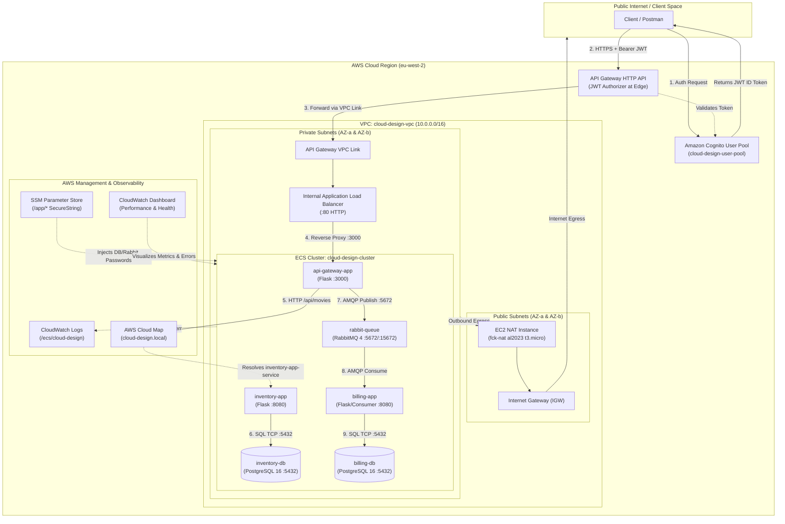

# Cloud-Design: Production-Ready Microservices Architecture on AWS

An enterprise-grade, highly available, cost-optimized microservices platform engineered on Amazon Web Services (AWS) using Terraform (Infrastructure as Code) and Docker containerization.

The platform implements a movie inventory management system and an asynchronous, decoupled billing processing engine. Public requests are ingested via an authenticated edge gateway, microservices communicate securely within private subnets via private DNS service discovery, sensitive credentials are managed with encryption at rest, and comprehensive observability is built into every layer.

---

## Table of Contents

1. [Architectural Overview](#architectural-overview)
2. [System Architecture Diagram](#system-architecture-diagram)
3. [Microservices & Container Specifications](#microservices--container-specifications)
4. [Core Engineering Pillars](#core-engineering-pillars)
   - [Scalability & Auto-Scaling](#1-scalability--auto-scaling)
   - [High Availability & Fault Tolerance](#2-high-availability--fault-tolerance)
   - [Defense-in-Depth Security](#3-defense-in-depth-security)
   - [Observability & Health Checks](#4-observability--health-checks)
   - [Simplicity & Infrastructure as Code](#5-simplicity--infrastructure-as-code)
5. [Comprehensive 1-Month Cost Estimation](#comprehensive-1-month-cost-estimation-730-hours)
6. [Repository Layout](#repository-layout)
7. [Prerequisites](#prerequisites)
8. [Step-by-Step Deployment Guide](#step-by-step-deployment-guide)
9. [Authentication & Cognito Setup](#authentication--cognito-setup)
10. [API Reference & Functional Verification](#api-reference--functional-verification)
11. [Billing & Queue Resilience Verification](#billing--queue-resilience-verification)
12. [Operations, Monitoring & Troubleshooting](#operations-monitoring--troubleshooting)
13. [Stakeholder Role-Play Q&A](#stakeholder-role-play-qa-interview-prep)
14. [Teardown & Cost Elimination](#teardown--cost-elimination)

---

## Architectural Overview

The architecture implements modern cloud-native best practices to deliver a secure, scalable, and resilient distributed system:

- **Edge Layer**: Public traffic enters through **AWS API Gateway (HTTP API v2)** backed by an **AWS Cognito JWT Authorizer**. Unauthenticated requests are rejected at the edge with `401 Unauthorized` before reaching internal VPC resources.
- **Private Ingress**: API Gateway communicates with an **Internal Application Load Balancer (ALB)** situated inside private subnets via an AWS **VPC Link**, eliminating public exposure of compute listeners.
- **Compute Layer**: Workloads run on **Amazon Elastic Container Service (ECS)** using the **EC2 Launch Type** backed by an **Auto Scaling Group (ASG)** across two Availability Zones. EC2 capacity is dynamically managed via an **ECS Capacity Provider**.
- **Internal Communication**: Microservices communicate privately using **AWS Cloud Map (Private DNS Namespace)** under `cloud-design.local` using `awsvpc` network mode.
- **Asynchronous Decoupling**: Billing transactions are published to **RabbitMQ 4** with durable message queues. The `billing-app` consumes messages asynchronously, ensuring zero message loss even during consumer downtime.
- **Secrets Management**: Passwords for PostgreSQL databases and RabbitMQ are securely stored in **AWS Systems Manager (SSM) Parameter Store** as `SecureString` types and decrypted at task runtime by the ECS Task Execution Role.
- **Unified Observability**: Container stdout/stderr logs stream to **Amazon CloudWatch Logs** with a 7-day retention policy. A tailored **CloudWatch Dashboard** provides operational visibility into request throughput, latency percentiles (p50, p95, p99), target health, CPU/Memory utilization, and real-time error logs.

---

## System Architecture Diagram



---

## Microservices & Container Specifications

| Container Name | Base Image | Container Port | Host Port | CPU Units | RAM | Protocol / Role |
|---|---|---|---|---|---|---|
| `api-gateway-app` | `python:3.12-alpine` | `3000` | `3000` | 600 | 600 MB | HTTP API Gateway, reverse proxy to inventory, publisher to RabbitMQ |
| `inventory-app` | `python:3.12-alpine` | `8080` | `8080` | 600 | 600 MB | CRUD REST API for movie catalogue, backed by PostgreSQL |
| `billing-app` | `python:3.12-alpine` | `8080` | `8080` | 600 | 600 MB | Asynchronous consumer for billing queue, backed by PostgreSQL |
| `rabbit-queue` | `rabbitmq:4-management-alpine` | `5672`, `15672` | `5672`, `15672` | 600 | 600 MB | Message broker (AMQP :5672, Management Web UI :15672) |
| `inventory-db` | `postgres:16-alpine` | `5432` | `5432` | 600 | 600 MB | Relational database storing movie inventory data |
| `billing-db` | `postgres:16-alpine` | `5432` | `5432` | 600 | 600 MB | Relational database storing billing and order records |

---

## Core Engineering Pillars

### 1. Scalability & Auto-Scaling

The solution implements a dual-layer elasticity model that dynamically adapts to traffic surges:

1. **ECS Service Auto-Scaling (Target Tracking)**:
   - Configured via AWS Application Auto Scaling for stateless workloads (`api-gateway-app` and `inventory-app`).
   - Policy: Target 80% average CPU utilization (`ECSServiceAverageCPUUtilization`).
   - Scale-out cooldown: **60 seconds** (rapid response to traffic bursts).
   - Scale-in cooldown: **300 seconds** (conservative spin-down preventing thrashing).
   - Capacity range: Min 1 task, Max 2 tasks per service.
2. **EC2 Capacity Provider & Auto Scaling Group**:
   - The ECS Cluster uses a capacity provider bound to the EC2 Auto Scaling Group (`min_size = 3`, `desired_capacity = 3`, `max_size = 4`).
   - Target capacity is configured at `90%`, prompting the ASG to launch additional EC2 container instances before compute exhaustion occurs.

### 2. High Availability & Fault Tolerance

- **Multi-AZ Network Architecture**: Subnets are divided across two Availability Zones (`eu-west-2a` and `eu-west-2b`). ECS tasks and EC2 host instances are distributed across both zones.
- **Asynchronous Decoupling**: The billing pipeline utilizes RabbitMQ message persistence (`delivery_mode=2`, `durable=True`). If `billing-app` fails or is scaled to zero, billing requests continue to be accepted by `api-gateway-app` and queued safely in RabbitMQ without dropping a single order.
- **Service Discovery**: AWS Cloud Map uses multi-value routing with a 10-second DNS TTL, enabling zero-downtime task replacement and seamless internal name resolution (`cloud-design.local`).

### 3. Defense-in-Depth Security

- **Edge Authentication**: AWS Cognito User Pool enforces strict password policies (minimum 8 characters, uppercase, lowercase, numbers, symbols). API Gateway validates incoming JWT tokens at the boundary, returning `401 Unauthorized` for invalid or missing tokens.
- **Network Segmentation & Micro-Segmentation**:
  - **No public IPs** on private ECS hosts or container tasks.
  - `alb-sg`: Permits inbound HTTP port 80 only from the VPC CIDR (`10.0.0.0/16`).
  - `app-sg`: Permits port 3000 only from `alb-sg`, and port 8080 from other microservices sharing `app-sg`.
  - `db-sg`: Permits PostgreSQL port 5432 strictly from containers with `app-sg`.
  - `rabbitmq-sg`: Permits AMQP port 5672 strictly from `app-sg`, and management port 15672 only within the VPC CIDR.
- **Least-Privilege IAM & Secret Encryption**:
  - Task Execution Role is scoped exclusively to read `/app/*` paths in AWS SSM Parameter Store.
  - Passwords are encrypted at rest using AWS KMS via `SecureString` SSM parameters.
- **Secure Remote Administration**: Remote access to private instances is managed via AWS Systems Manager (SSM) Session Manager, eliminating the need for public bastion hosts or open SSH port 22.

### 4. Observability & Health Checks

- **Container Health Probing**:
  - `api-gateway-app`, `inventory-app`, `billing-app`: Python HTTP check on `/health` (30s interval, 5s timeout, 3 retries).
  - `inventory-db`, `billing-db`: PostgreSQL native `pg_isready` check (30s interval, 60s start period).
  - `rabbit-queue`: `rabbitmq-diagnostics -q ping` health check (30s interval, 60s start period).
- **ALB Health Checks**: Evaluates `GET /health` on port 3000 every 30 seconds (healthy threshold = 3).
- **Centralized Logging**: All containers stream logs to `/ecs/cloud-design` in CloudWatch Logs with a 7-day retention window.
- **Custom Operations Dashboard (`cloud-design-performance-and-health`)**:
  - *Widget 1*: API Gateway Request Throughput & Error Counts (4xx, 5xx).
  - *Widget 2*: API Response Latency Percentiles (p50, p95, p99).
  - *Widget 3*: ALB Healthy vs Unhealthy Target Container Counts.
  - *Widget 4 & 5*: Aggregate Cluster CPU and Memory Utilization.
  - *Widget 6 & 7*: Per-Microservice CPU and Memory Utilization metrics.
  - *Widget 8*: CloudWatch Logs Insights Live Error and Exception Stream table.

### 5. Simplicity & Infrastructure as Code

- **Modular Terraform Architecture**: Clean separation into `networking`, `compute`, `security_identity`, and `services`.
- **Remote State Protection**: S3 backend with AES-256 encryption and native S3 state locking (`use_lockfile = true`).
- **Optimized Dockerfiles**: Multi-stage/Alpine-based images ensuring fast build times and minimal attack surfaces.

---

## Comprehensive 1-Month Cost Estimation (730 Hours)

The following estimate details continuous 24/7 operation over a full 1-month period (730 hours) in AWS Region `eu-west-2` (London) under standard On-Demand pricing.

### Line-Item Cost Breakdown

| Component | AWS Resource / Tier | Hourly / Unit Rate | Monthly Calculation | Estimated Monthly Cost |
|---|---|---|---|---:|
| **Virtual Private Cloud (VPC)** | Subnets, Route Tables, Internet Gateway | $0.00 / hour | Included with AWS networking | **$0.00** |
| **NAT Instance Compute** | 1 × EC2 `t3.micro` (`fck-nat` AMI) | $0.0104 / hour | $0.0104 × 730 hours | **$7.59** |
| **NAT Instance Root Volume** | 8 GB gp3 EBS Volume | $0.08 / GB-month | 8 GB × $0.08 | **$0.64** |
| **Public IPv4 Address** | 1 × Public IPv4 (NAT Instance) | $0.005 / hour | $0.005 × 730 hours | **$3.65** |
| **ECS Container Instances** | 3 × EC2 `t3.small` (On-Demand) | $0.0208 / hour / instance | 3 × $0.0208 × 730 hours | **$45.55** |
| **ECS Hosts Storage** | 3 × 30 GB gp3 EBS Volumes (AL2023) | $0.08 / GB-month | 90 GB × $0.08 | **$7.20** |
| **ECS Control Plane** | Amazon ECS Service Scheduling | $0.00 / hour | Free with EC2 Launch Type | **$0.00** |
| **Application Load Balancer** | 1 × Internal ALB Base Fee | $0.0225 / hour | $0.0225 × 730 hours | **$16.43** |
| **ALB Capacity Units (LCU)** | Low traffic / Lab usage (< 1 LCU) | ~$0.008 / LCU-hour | Variable usage (~$0.001/hr avg) | **$1.00** |
| **API Gateway HTTP API (v2)** | API Ingestion & Routing | $1.00 / million requests | Lab traffic (< 100k requests) | **$0.10** |
| **API Gateway VPC Link (v2)** | VPC Link for HTTP APIs | $0.00 / hour | $0.00 (No hourly fee for v2 HTTP APIs) | **$0.00** |
| **AWS Cognito User Pool** | User Authentication & JWTs | $0.00 | Free Tier covers up to 10,000 MAUs | **$0.00** |
| **AWS SSM Parameter Store** | 3 × `SecureString` Parameters | $0.00 | Standard parameters are free | **$0.00** |
| **AWS Cloud Map** | Private DNS Namespace & Service Records | $0.00 | Private DNS records included in VPC | **$0.00** |
| **Application Auto Scaling** | Target Tracking Scaling Service | $0.00 | Free management service | **$0.00** |
| **CloudWatch Logs Ingestion** | Log storage with 7-day retention | $0.50 / GB ingested | Free Tier includes 5 GB / month | **$0.20** |
| **CloudWatch Custom Dashboard** | 1 × Custom Monitoring Dashboard | $0.00 | Free Tier includes up to 3 dashboards | **$0.00** |
| **CloudWatch Logs Insights** | Query processing for error logs | $0.005 / GB scanned | Lab volume (< 100 MB scanned) | **$0.01** |
| **Amazon S3 State Storage** | Remote Terraform state bucket | $0.023 / GB-month | State file < 10 MB | **< $0.01** |
| **Data Transfer (Intra-VPC / Out)** | Egress & Cross-AZ communication | Variable | Low volume lab usage | **~$0.60** |

---

### Monthly Cost Summary

```text
================================================================================
LAYER                                                   ESTIMATED MONTHLY COST
================================================================================
1. Networking (VPC, Subnets, NAT EC2, Public IP, EBS)                 $11.88
2. Compute Capacity (3x t3.small EC2 Hosts + 90GB EBS)                $52.75
3. Edge & Load Balancing (Internal ALB + LCU + HTTP API)              $17.53
4. Identity, Secrets & Discovery (Cognito, SSM, Cloud Map)             $0.00
5. Observability & State Storage (CloudWatch, S3 State)                $0.21
6. Data Transfer & Inter-AZ Overhead                                   $0.60
================================================================================
TOTAL ESTIMATED 1-MONTH RUNTIME (ON-DEMAND):                          ~$82.97 / month
                                                                      (~ $2.76 / day)
================================================================================
```

### Cost Optimization Strategies Implemented

1. **`fck-nat` Lightweight NAT Instance vs AWS NAT Gateway**: Replacing an AWS-managed NAT Gateway ($32.85/mo + $0.045/GB data processing) with a `t3.micro` `fck-nat` instance ($7.59/mo) reduces monthly baseline networking costs by **over 70%**.
2. **HTTP API (v2) vs REST API (v1)**: Utilizing HTTP APIs ($1.00/million requests and **$0.00 VPC Link hourly charge**) rather than REST APIs ($3.50/million + $0.07/hour VPC Link charge = ~$51/mo) saves **over $50 per month**.
3. **Log Retention Limits**: A 7-day retention policy on `/ecs/cloud-design` prevents unbounded CloudWatch storage growth.
4. **Standard SSM & Free Tier Cognito**: Maximizes native AWS free tier benefits (Cognito up to 10,000 monthly active users and standard SSM parameters).

---

## Repository Layout

```text
.
├── dockerfiles/
│   ├── api-gateway-app/               # Edge application (Flask :3000)
│   │   ├── app/
│   │   │   ├── __init__.py            # Flask app factory, logging & /health
│   │   │   ├── billing_routes.py      # /api/billing -> RabbitMQ publisher
│   │   │   ├── config.py              # Environment configuration loader
│   │   │   └── inventory_routes.py    # /api/movies -> inventory-app reverse proxy
│   │   ├── Dockerfile                 # Python 3.12 Alpine container
│   │   ├── requirements.txt           # Flask, requests, pika, python-dotenv
│   │   └── server.py                  # Application entry point
│   ├── inventory-app/                 # Movie CRUD service (Flask :8080)
│   │   ├── app/
│   │   │   ├── __init__.py            # App factory, DB init & /health
│   │   │   ├── config.py              # PostgreSQL database connection URI
│   │   │   ├── database.py            # SQLAlchemy Model (Movie)
│   │   │   ├── movie_repository.py    # Database CRUD operations
│   │   │   └── movie_routes.py        # /api/movies REST endpoints
│   │   ├── Dockerfile                 # Python 3.12 Alpine container
│   │   ├── requirements.txt           # Flask, SQLAlchemy, psycopg2-binary
│   │   └── server.py                  # Service entry point
│   └── billing-app/                   # Asynchronous billing service (Flask :8080)
│       ├── app/
│       │   ├── __init__.py            # App factory, DB init & /health
│       │   ├── billing_consumer.py    # RabbitMQ background worker thread
│       │   ├── config.py              # RabbitMQ & PostgreSQL credentials
│       │   └── database.py            # SQLAlchemy Model (Order)
│       ├── Dockerfile                 # Python 3.12 Alpine container
│       ├── requirements.txt           # Flask, SQLAlchemy, pika, psycopg2-binary
│       └── server.py                  # Consumer thread launcher & web server
├── docs/
│   ├── compute-foundation.md          # Guide to ECS, ASG, Launch Templates & Capacity Providers
│   ├── edge-security-and-observability-foundation.md # Guide to ALB, API GW, Cognito & CloudWatch
│   ├── infra-and-networking-foundation.md            # Guide to VPC, Subnets, Routes & NAT
│   ├── services-and-discovery-foundation.md          # Guide to ECS Tasks, Services & Cloud Map
│   └── subject/                       # Original project subject & audit guidelines
│       ├── cloud-design.md
│       └── cloud-design-audit.md
├── terraform/
│   ├── aws_init.sh                    # Automated helper: registers test user & gets JWT
│   ├── backend.tf                     # S3 remote state configuration with locking
│   ├── main.tf                        # Root module connecting all infrastructure layers
│   ├── outputs.tf                     # Root Terraform outputs (endpoints, URLs, IDs)
│   ├── provider.tf                    # AWS provider configuration
│   ├── terraform.tfvars.example       # Sample input variables file
│   ├── variables.tf                   # Root variable declarations
│   └── modules/
│       ├── compute/                   # ECS Cluster, Launch Template, ASG, Capacity Provider
│       ├── networking/                # VPC, Subnets, Internet Gateway, Routes, fck-nat
│       ├── security_identity/         # IAM Roles, Cognito User Pool/Client, SSM, ALB
│       └── services/                  # ECS Task Definitions, Services, Cloud Map, Dashboard
├── CRUD-master.postman_collection.json# Postman test collection
└── README.md                          # Comprehensive project documentation
```

---

## Prerequisites

Ensure the following tools are installed and configured on your management machine:

- **Terraform** `>= 1.15.8` ([Installation Guide](https://developer.hashicorp.com/terraform/downloads))
- **AWS CLI v2** ([Installation Guide](https://docs.aws.amazon.com/cli/latest/userguide/getting-started-install.html))
- **Docker Engine** & **Docker Hub Account** ([Installation Guide](https://docs.docker.com/get-docker/))
- **AWS Session Manager CLI Plugin** ([Installation Guide](https://docs.aws.amazon.com/systems-manager/latest/userguide/session-manager-working-with-install-plugin.html))
- **Postman** or **cURL** for API validation.

---

## Step-by-Step Deployment Guide

### Step 1: Configure AWS CLI & Environment

```bash
aws configure
aws sts get-caller-identity
```

Ensure your IAM identity has administrative permissions to provision networking, compute, IAM, and security resources in region `eu-west-2`.

### Step 2: Bootstrap S3 Remote State Bucket

Before initializing Terraform, ensure the remote state S3 bucket exists:

```bash
aws s3api create-bucket \
  --bucket cloud-design-remote-state \
  --region eu-west-2 \
  --create-bucket-configuration LocationConstraint=eu-west-2

aws s3api put-bucket-versioning \
  --bucket cloud-design-remote-state \
  --versioning-configuration Status=Enabled

aws s3api put-bucket-encryption \
  --bucket cloud-design-remote-state \
  --server-side-encryption-configuration '{"Rules":[{"ApplyServerSideEncryptionByDefault":{"SSEAlgorithm":"AES256"}}]}'

aws s3api put-public-access-block \
  --bucket cloud-design-remote-state \
  --public-access-block-configuration BlockPublicAcls=true,IgnorePublicAcls=true,BlockPublicPolicy=true,RestrictPublicBuckets=true
```

### Step 3: Configure Terraform Variables

Create your `terraform/terraform.tfvars` from the example template:

```bash
cp terraform/terraform.tfvars.example terraform/terraform.tfvars
```

Edit `terraform/terraform.tfvars` and provide your specific credentials:

```hcl
region                = "eu-west-2"
vpc_cidr              = "10.0.0.0/16"
public_subnet_cidrs   = ["10.0.10.0/24", "10.0.11.0/24"]
private_subnet_cidrs  = ["10.0.20.0/24", "10.0.21.0/24"]
azs                   = ["eu-west-2a", "eu-west-2b"]
project_name          = "cloud-design"
dockerhub_username    = "your-dockerhub-username"
billing_db_password   = "StrongBillingPassword123!"
inventory_db_password = "StrongInventoryPassword123!"
rabbitmq_password     = "StrongRabbitPassword123!"
```

### Step 4: Build & Publish Container Images

Log in to Docker Hub, build all three microservices, and push them to your registry:

```bash
docker login

DOCKERHUB_USERNAME="your-dockerhub-username"

docker build -t "$DOCKERHUB_USERNAME/api-gateway-app:latest" dockerfiles/api-gateway-app
docker build -t "$DOCKERHUB_USERNAME/inventory-app:latest" dockerfiles/inventory-app
docker build -t "$DOCKERHUB_USERNAME/billing-app:latest" dockerfiles/billing-app

docker push "$DOCKERHUB_USERNAME/api-gateway-app:latest"
docker push "$DOCKERHUB_USERNAME/inventory-app:latest"
docker push "$DOCKERHUB_USERNAME/billing-app:latest"
```

### Step 5: Provision Infrastructure with Terraform

Execute Terraform from the repository root using `-chdir=terraform`:

```bash
terraform -chdir=terraform init
terraform -chdir=terraform fmt -check -recursive
terraform -chdir=terraform validate
terraform -chdir=terraform plan
terraform -chdir=terraform apply
```

Upon successful completion, Terraform outputs all vital endpoints and identifiers:

```bash
terraform -chdir=terraform output
```

### Step 6: Verify Running Microservices & Health

```bash
aws ecs describe-services \
  --region eu-west-2 \
  --cluster cloud-design-cluster \
  --services \
    cloud-design-api-gateway-app \
    cloud-design-inventory-app \
    cloud-design-billing-app \
    cloud-design-inventory-db \
    cloud-design-billing-db \
    cloud-design-rabbit-queue \
  --query 'services[*].{Service:serviceName,Status:status,Desired:desiredCount,Running:runningCount}' \
  --output table
```

---

## Authentication & Cognito Setup

All routes exposed through API Gateway are secured by a Cognito JWT Authorizer.

### Automated Setup (Recommended)

Run the included initialization script to create a verified test user and extract a JWT token:

```bash
chmod +x terraform/aws_init.sh
./terraform/aws_init.sh
```

### Manual Setup via AWS CLI

1. **Export Variables**:
   ```bash
   API_GATEWAY_URL=$(terraform -chdir=terraform output -raw api_gateway_url)
   USER_POOL_ID=$(terraform -chdir=terraform output -raw user_pool_id)
   CLIENT_ID=$(terraform -chdir=terraform output -raw user_pool_client_id)
   
   USER_EMAIL="admin@cloud.design"
   USER_PASS="CloudPass1234*!"
   ```

2. **Register & Confirm User**:
   ```bash
   aws cognito-idp sign-up \
     --region eu-west-2 \
     --client-id "$CLIENT_ID" \
     --username "$USER_EMAIL" \
     --password "$USER_PASS" \
     --user-attributes Name=email,Value="$USER_EMAIL"

   aws cognito-idp admin-confirm-sign-up \
     --region eu-west-2 \
     --user-pool-id "$USER_POOL_ID" \
     --username "$USER_EMAIL"
   ```

3. **Authenticate to Obtain JWT ID Token**:
   ```bash
   JWT_TOKEN=$(aws cognito-idp initiate-auth \
     --region eu-west-2 \
     --auth-flow USER_PASSWORD_AUTH \
     --client-id "$CLIENT_ID" \
     --auth-parameters USERNAME="$USER_EMAIL",PASSWORD="$USER_PASS" \
     --query 'AuthenticationResult.IdToken' \
     --output text)

   echo "Generated JWT Token: $JWT_TOKEN"
   ```

---

## API Reference & Functional Verification

### 1. Verification of Authentication Enforcement (401 Unauthorized)

Verify that requests without a valid Bearer token are rejected at the edge:

```bash
curl -i "$API_GATEWAY_URL/api/movies"
```
**Expected Response:**
```http
HTTP/2 401 
content-type: application/json
{"message":"Unauthorized"}
```

---

### 2. Movie Inventory CRUD Workflows

#### Create a New Movie (`POST /api/movies`)
```bash
curl -i -X POST "$API_GATEWAY_URL/api/movies" \
  -H "Authorization: Bearer $JWT_TOKEN" \
  -H "Content-Type: application/json" \
  -d '{"title": "Inception", "description": "A thief who steals corporate secrets through the use of dream-sharing technology."}'
```
**Expected Response (HTTP 201 Created):**
```json
{
  "id": 1,
  "title": "Inception",
  "description": "A thief who steals corporate secrets through the use of dream-sharing technology."
}
```

#### Create a Second Movie (`POST /api/movies`)
```bash
curl -i -X POST "$API_GATEWAY_URL/api/movies" \
  -H "Authorization: Bearer $JWT_TOKEN" \
  -H "Content-Type: application/json" \
  -d '{"title": "Interstellar", "description": "A team of explorers travel through a wormhole in space in an attempt to ensure humanity survival."}'
```

#### List All Movies (`GET /api/movies`)
```bash
curl -i "$API_GATEWAY_URL/api/movies" \
  -H "Authorization: Bearer $JWT_TOKEN"
```

#### Search Movie by Title Query (`GET /api/movies?title=inter`)
```bash
curl -i "$API_GATEWAY_URL/api/movies?title=inter" \
  -H "Authorization: Bearer $JWT_TOKEN"
```

#### Retrieve Single Movie (`GET /api/movies/1`)
```bash
curl -i "$API_GATEWAY_URL/api/movies/1" \
  -H "Authorization: Bearer $JWT_TOKEN"
```

#### Update Movie Details (`PUT /api/movies/1`)
```bash
curl -i -X PUT "$API_GATEWAY_URL/api/movies/1" \
  -H "Authorization: Bearer $JWT_TOKEN" \
  -H "Content-Type: application/json" \
  -d '{"title": "Inception (Director Cut)", "description": "Updated description with extended cut details."}'
```

#### Delete Single Movie (`DELETE /api/movies/1`)
```bash
curl -i -X DELETE "$API_GATEWAY_URL/api/movies/1" \
  -H "Authorization: Bearer $JWT_TOKEN"
```

#### Delete All Movies (`DELETE /api/movies`)
```bash
curl -i -X DELETE "$API_GATEWAY_URL/api/movies" \
  -H "Authorization: Bearer $JWT_TOKEN"
```

---

## Billing & Queue Resilience Verification

This test demonstrates the asynchronous fault-tolerance of the messaging queue. The API Gateway safely accepts and enqueues billing requests even when the backend consumer service is down.

### Step 1: Scale the Billing Consumer Service to Zero (Simulate Outage)

```bash
aws ecs update-service \
  --region eu-west-2 \
  --cluster cloud-design-cluster \
  --service cloud-design-billing-app \
  --desired-count 0
```

Verify that no billing tasks are running:
```bash
aws ecs list-tasks \
  --region eu-west-2 \
  --cluster cloud-design-cluster \
  --service-name cloud-design-billing-app
```

### Step 2: Submit Billing Requests through API Gateway

Send a billing order while the consumer is completely offline:

```bash
curl -i -X POST "$API_GATEWAY_URL/api/billing" \
  -H "Authorization: Bearer $JWT_TOKEN" \
  -H "Content-Type: application/json" \
  -d '{"user_id": 42, "number_of_items": 3, "total_amount": 150}'
```
**Expected Response (HTTP 200 OK):**
```json
{
  "message": "Message posted"
}
```
*The request succeeds because `api-gateway-app` successfully enqueues the durable message into RabbitMQ.*

### Step 3: Restore the Billing Consumer Service

Scale the service back to 1 desired task:

```bash
aws ecs update-service \
  --region eu-west-2 \
  --cluster cloud-design-cluster \
  --service-name cloud-design-billing-app \
  --desired-count 1
```

### Step 4: Verify Queued Message Consumption & Database Persistence

Tail the CloudWatch logs to verify that the consumer processed the queued order upon starting:

```bash
aws logs tail /ecs/cloud-design \
  --region eu-west-2 \
  --log-stream-name-prefix billing-app \
  --follow
```

---

## Operations, Monitoring & Troubleshooting

### 1. Secure Shell Access via AWS Session Manager (No SSH Required)

Connect to private ECS EC2 container instances without opening inbound firewall ports:

```bash
INSTANCE_ID=$(aws ec2 describe-instances \
  --region eu-west-2 \
  --filters 'Name=instance-state-name,Values=running' 'Name=tag:Name,Values=cloud-design-ecs-host' \
  --query 'Reservations[0].Instances[0].InstanceId' \
  --output text)

aws ssm start-session --region eu-west-2 --target "$INSTANCE_ID"
```

Once inside the host session, inspect containers and interact with PostgreSQL:

```bash
# View running containers on host
sudo docker ps

# Connect to Inventory Database directly
INVENTORY_CONTAINER=$(sudo docker ps -qf "name=inventory-db")
sudo docker exec -it "$INVENTORY_CONTAINER" psql -U inventory_user -d inventory_db -c "SELECT * FROM movies;"

# Connect to Billing Database directly
BILLING_CONTAINER=$(sudo docker ps -qf "name=billing-db")
sudo docker exec -it "$BILLING_CONTAINER" psql -U billing_user -d billing_db -c "SELECT * FROM orders;"
```

### 2. Live CloudWatch Log Streaming

```bash
# Stream all container logs simultaneously
aws logs tail /ecs/cloud-design --region eu-west-2 --follow

# Stream only API Gateway container logs
aws logs tail /ecs/cloud-design --region eu-west-2 --log-stream-name-prefix api-gateway --follow

# Stream only Inventory service logs
aws logs tail /ecs/cloud-design --region eu-west-2 --log-stream-name-prefix inventory-app --follow
```

### 3. Triggering Zero-Downtime Rolling Deployments

After publishing updated container images to Docker Hub:

```bash
aws ecs update-service \
  --region eu-west-2 \
  --cluster cloud-design-cluster \
  --service cloud-design-api-gateway-app \
  --force-new-deployment
```

### 4. Rotating Database Credentials via SSM Parameter Store

Rotate credentials in SSM without redeploying Terraform infrastructure:

```bash
aws ssm put-parameter \
  --region eu-west-2 \
  --name /app/inventory_db/password \
  --value "NewSuperSecurePassword999!" \
  --type SecureString \
  --overwrite
```

---
