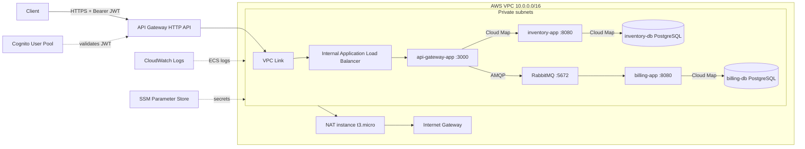

# cloud-design

An AWS microservices platform built with Docker and Terraform. The project runs a small movie inventory API and an asynchronous billing workflow on Amazon ECS using EC2-backed capacity.

It is designed as a practical cloud-infrastructure project: public requests enter through an authenticated API Gateway, private services communicate through AWS Cloud Map, secrets are injected from SSM Parameter Store, and container logs are sent to CloudWatch.

> **Project status:** functional learning/lab deployment. The infrastructure is intentionally cost-conscious, but it still has production trade-offs such as a single NAT instance, single-replica stateful services, and database storage living inside ephemeral ECS tasks. Review the [operational considerations](#operational-considerations) before using it for production workloads.

## What this project provides

- A custom VPC with two public and two private subnets across two Availability Zones.
- A low-cost EC2 NAT instance for outbound internet access from private subnets.
- An Amazon ECS cluster using the EC2 launch type, an Auto Scaling group, and a capacity provider.
- Three Python containers:
  - `api-gateway-app` — public application gateway for inventory and billing requests.
  - `inventory-app` — CRUD API backed by PostgreSQL.
  - `billing-app` — RabbitMQ consumer backed by PostgreSQL.
- Three supporting containers:
  - `inventory-db` — PostgreSQL 16.
  - `billing-db` — PostgreSQL 16.
  - `rabbit-queue` — RabbitMQ 4 with the management plugin.
- AWS API Gateway HTTP API with a Cognito JWT authorizer.
- An internal Application Load Balancer connected to API Gateway through a VPC Link.
- AWS Cloud Map private DNS service discovery under `cloud-design.local`.
- SSM Parameter Store `SecureString` parameters for database and RabbitMQ passwords.
- CloudWatch Logs and an ECS CPU/memory dashboard.

## Architecture



### Request flow

1. A client authenticates with Cognito and receives a JWT.
2. The client sends a request with `Authorization: Bearer <token>` to API Gateway.
3. API Gateway validates the JWT at the edge and rejects unauthenticated requests with `401 Unauthorized`.
4. API Gateway sends authorized traffic through a private VPC Link to the internal ALB.
5. The ALB forwards traffic to `api-gateway-app`.
6. The gateway calls the inventory service synchronously or publishes billing messages to RabbitMQ.
7. `billing-app` consumes durable messages and writes orders to the billing database.

## AWS resources at a glance

| Layer | Resources | Important defaults |
| --- | --- | --- |
| Networking | VPC, Internet Gateway, route tables, 2 public subnets, 2 private subnets | `10.0.0.0/16`, default region `eu-west-2` |
| Private egress | `fck-nat` EC2 NAT instance | `t3.micro`, placed in the first public subnet |
| Compute | ECS cluster, ECS-optimized AL2023 hosts, launch template, ASG, capacity provider | `t3.small` hosts; ASG min `1`, desired `2`, max `3` |
| Edge | API Gateway HTTP API, Cognito JWT authorizer, VPC Link, internal ALB | API Gateway is public; ALB and services are private |
| Services | 3 application containers, 2 PostgreSQL containers, 1 RabbitMQ container | ECS `awsvpc` networking, desired count `1` each |
| Discovery | AWS Cloud Map private DNS namespace | `cloud-design.local` |
| Secrets | SSM Parameter Store | `/app/inventory_db/password`, `/app/billing_db/password`, `/app/rabbitmq/password` |
| Observability | CloudWatch log group and dashboard | `/ecs/cloud-design`, log retention `7` days |

## Repository layout

```text
.
├── dockerfiles/
│   ├── api-gateway-app/     # Flask edge application
│   ├── inventory-app/       # Movie CRUD service
│   └── billing-app/         # Billing API/consumer service
├── terraform/
│   ├── main.tf              # Root module composition
│   ├── backend.tf           # S3 remote state configuration
│   ├── variables.tf         # Root input variables
│   ├── outputs.tf            # Root infrastructure outputs
│   └── modules/
│       ├── networking/      # VPC, subnets, routes, NAT instance
│       ├── compute/         # ECS EC2 capacity
│       ├── security_identity/# IAM, Cognito, SSM, ALB
│       └── services/         # ECS tasks, services, discovery, logs
└── terraform/aws_init.sh    # Optional Cognito user/token helper
```

## Prerequisites

Install and configure:

- Terraform `>= 1.15.8`.
- AWS CLI with credentials permitted to create the resources in `terraform/`.
- Docker and a Docker Hub account.
- The Session Manager plugin if you want interactive access to private ECS hosts.

The configured backend expects an S3 bucket named `cloud-design-remote-state` in `eu-west-2`. Create and secure that bucket before running `terraform init`; the bucket is deliberately not managed by this stack.

Recommended backend hardening includes versioning, default encryption, S3 Block Public Access, and least-privilege access for the deployment identity.

## Quick start

### 1. Configure AWS

```bash
aws configure
aws sts get-caller-identity
```

Use the same AWS region as the Terraform backend (`eu-west-2`) unless you also update `terraform/backend.tf` and the region-specific values in the Terraform modules.

### 2. Prepare Terraform variables

```bash
cp terraform/terraform.tfvars.example terraform/terraform.tfvars
```

Edit `terraform/terraform.tfvars` and set your own values, especially:

- `dockerhub_username`
- `billing_db_password`
- `inventory_db_password`
- `rabbitmq_password`

The `.gitignore` excludes `*.tfvars`. Never commit real credentials, tokens, or Terraform state.

### 3. Build and publish the application images

The ECS task definitions pull the following Docker Hub images with the `:latest` tag, so publish them before starting the services:

```bash
docker login

DOCKERHUB_USERNAME="your-dockerhub-username"

docker build -t "$DOCKERHUB_USERNAME/api-gateway-app:latest" dockerfiles/api-gateway-app
docker build -t "$DOCKERHUB_USERNAME/inventory-app:latest" dockerfiles/inventory-app
docker build -t "$DOCKERHUB_USERNAME/billing-app:latest" dockerfiles/billing-app

docker push "$DOCKERHUB_USERNAME/api-gateway-app:latest"
docker push "$DOCKERHUB_USERNAME/inventory-app:latest"
docker push "$DOCKERHUB_USERNAME/billing-app:latest"
```

Make sure the Docker Hub username matches `dockerhub_username` in `terraform.tfvars`.

### 4. Initialize, validate, plan, and apply

Run Terraform from the repository root with the `-chdir` option:

```bash
terraform -chdir=terraform init
terraform -chdir=terraform fmt -check -recursive
terraform -chdir=terraform validate
terraform -chdir=terraform plan
terraform -chdir=terraform apply
```

Review the plan carefully before applying. The first deployment creates paid AWS resources, including EC2 instances, public IPv4 addresses, and data-transfer paths.

### 5. Inspect the deployment

```bash
terraform -chdir=terraform output

aws ecs describe-services \
  --region eu-west-2 \
  --cluster cloud-design-cluster \
  --services \
    cloud-design-api-gateway-app \
    cloud-design-inventory-app \
    cloud-design-inventory-db \
    cloud-design-billing-app \
    cloud-design-billing-db \
    cloud-design-rabbit-queue \
  --query 'services[*].{Service:serviceName,Status:status,Desired:desiredCount,Running:runningCount}' \
  --output table
```

## Getting the public API URL and Cognito identifiers

The API Gateway URL and Cognito identifiers are created inside Terraform modules. The current root `terraform/outputs.tf` exposes the internal service-discovery outputs but does not re-export all of those module values. Retrieve the live values with AWS CLI:

```bash
REGION="eu-west-2"

API_GATEWAY_URL=$(aws apigatewayv2 get-apis \
  --region "$REGION" \
  --query "Items[?Name=='cloud-design-api-gateway'].ApiEndpoint | [0]" \
  --output text)

USER_POOL_ID=$(aws cognito-idp list-user-pools \
  --region "$REGION" \
  --max-results 60 \
  --query "UserPools[?Name=='cloud-design-user-pool'].Id | [0]" \
  --output text)

CLIENT_ID=$(aws cognito-idp list-user-pool-clients \
  --region "$REGION" \
  --user-pool-id "$USER_POOL_ID" \
  --query 'UserPoolClients[0].ClientId' \
  --output text)

echo "API Gateway: $API_GATEWAY_URL"
echo "User pool:   $USER_POOL_ID"
echo "App client:  $CLIENT_ID"
```

## Authenticate with Cognito

Create a test user and confirm it. Use a strong password that satisfies the pool policy: at least eight characters, with uppercase, lowercase, number, and symbol.

```bash
TEST_EMAIL="you@example.com"
TEST_PASSWORD="replace-with-a-strong-password"

aws cognito-idp sign-up \
  --region eu-west-2 \
  --client-id "$CLIENT_ID" \
  --username "$TEST_EMAIL" \
  --password "$TEST_PASSWORD" \
  --user-attributes Name=email,Value="$TEST_EMAIL"

aws cognito-idp admin-confirm-sign-up \
  --region eu-west-2 \
  --user-pool-id "$USER_POOL_ID" \
  --username "$TEST_EMAIL"

JWT_TOKEN=$(aws cognito-idp initiate-auth \
  --region eu-west-2 \
  --auth-flow USER_PASSWORD_AUTH \
  --client-id "$CLIENT_ID" \
  --auth-parameters USERNAME="$TEST_EMAIL",PASSWORD="$TEST_PASSWORD" \
  --query 'AuthenticationResult.IdToken' \
  --output text)
```

The repository also includes `terraform/aws_init.sh`, which automates user registration and token generation. Review its hard-coded test credentials before using it in any shared or production environment.

## API reference

All routes exposed through API Gateway require a valid Cognito JWT.

### Movies

Create a movie:

```bash
curl -i -X POST "$API_GATEWAY_URL/api/movies" \
  -H "Authorization: Bearer $JWT_TOKEN" \
  -H "Content-Type: application/json" \
  -d '{"title":"Interstellar","description":"A team travels through a wormhole in search of a new home."}'
```

List movies:

```bash
curl -i "$API_GATEWAY_URL/api/movies" \
  -H "Authorization: Bearer $JWT_TOKEN"
```

Filter by title:

```bash
curl -i "$API_GATEWAY_URL/api/movies?title=inter" \
  -H "Authorization: Bearer $JWT_TOKEN"
```

The inventory service also supports:

```text
GET    /api/movies/<id>
PUT    /api/movies/<id>       JSON: title and/or description
DELETE /api/movies/<id>
DELETE /api/movies             Deletes all movies
```

### Billing

Billing requests are published to the durable RabbitMQ queue and consumed asynchronously by `billing-app`:

```bash
curl -i -X POST "$API_GATEWAY_URL/api/billing" \
  -H "Authorization: Bearer $JWT_TOKEN" \
  -H "Content-Type: application/json" \
  -d '{"user_id":77,"number_of_items":2,"total_amount":8999}'
```

The consumer writes the resulting order to the billing PostgreSQL database. The application currently expects `user_id`, `number_of_items`, and `total_amount` to be integer-compatible values.

### Authentication check

This should return `401 Unauthorized`:

```bash
curl -i "$API_GATEWAY_URL/api/movies"
```

## Operations

### Terraform

```bash
terraform -chdir=terraform fmt -recursive
terraform -chdir=terraform validate
terraform -chdir=terraform plan
terraform -chdir=terraform apply
terraform -chdir=terraform output
terraform -chdir=terraform destroy
```

`destroy` removes resources managed by this Terraform state. It does not remove the separately bootstrapped S3 backend bucket.

### ECS service control

```bash
aws ecs list-tasks \
  --region eu-west-2 \
  --cluster cloud-design-cluster

aws ecs update-service \
  --region eu-west-2 \
  --cluster cloud-design-cluster \
  --service cloud-design-billing-app \
  --desired-count 0

aws ecs update-service \
  --region eu-west-2 \
  --cluster cloud-design-cluster \
  --service cloud-design-billing-app \
  --desired-count 1

aws ecs update-service \
  --region eu-west-2 \
  --cluster cloud-design-cluster \
  --service cloud-design-billing-app \
  --force-new-deployment
```

Because images use the mutable `latest` tag, force a new deployment after pushing a replacement image.

### Logs and monitoring

```bash
aws logs tail /ecs/cloud-design \
  --region eu-west-2 \
  --follow

aws logs tail /ecs/cloud-design \
  --region eu-west-2 \
  --log-stream-name-prefix billing-app \
  --follow

aws logs tail /ecs/cloud-design \
  --region eu-west-2 \
  --log-stream-name-prefix api-gateway \
  --follow
```

Open the `cloud-design-ecs-dashboard` CloudWatch dashboard to inspect the ECS CPU and memory metrics configured by Terraform.

### Private host and database access

ECS hosts run in private subnets. Use Systems Manager Session Manager instead of opening SSH or database ports to the internet:

```bash
INSTANCE_ID=$(aws ec2 describe-instances \
  --region eu-west-2 \
  --filters 'Name=instance-state-name,Values=running' \
  --query 'Reservations[].Instances[].InstanceId | [0]' \
  --output text)

aws ssm start-session \
  --region eu-west-2 \
  --target "$INSTANCE_ID"
```

Inside the host session:

```bash
sudo docker ps
sudo docker exec -it <INVENTORY_DB_CONTAINER_ID> psql -U inventory_user -d inventory_db
sudo docker exec -it <BILLING_DB_CONTAINER_ID> psql -U billing_user -d billing_db
```

Useful `psql` commands include `\dt`, `SELECT * FROM movies;`, and `\q`.

## Secrets and IAM model

Terraform creates these encrypted SSM parameters:

```text
/app/inventory_db/password
/app/billing_db/password
/app/rabbitmq/password
```

The ECS task execution role can read parameters below `/app/*` and is responsible for injecting them into task containers. The application task role has the Cognito permissions defined in `terraform/modules/security_identity/iam.tf`.

Terraform ignores later changes to the parameter values with `lifecycle { ignore_changes = [value] }`. This allows operators to rotate the live values out-of-band:

```bash
read -rsp 'New inventory database password: ' INVENTORY_DB_PASSWORD
echo

aws ssm put-parameter \
  --region eu-west-2 \
  --name /app/inventory_db/password \
  --value "$INVENTORY_DB_PASSWORD" \
  --type SecureString \
  --overwrite

unset INVENTORY_DB_PASSWORD
```

Do not put secrets directly in Dockerfiles, source code, image tags, shell history, or committed `.tfvars` files.

## Resilience test

The billing workflow is intentionally asynchronous. To demonstrate that a queue can absorb work while its consumer is unavailable:

1. Scale `cloud-design-billing-app` to zero.
2. Submit a valid `POST /api/billing` request.
3. Restore the billing service to one task.
4. Follow the `billing-app` logs and verify that the queued message is consumed and persisted.

```bash
aws ecs update-service --region eu-west-2 --cluster cloud-design-cluster --service cloud-design-billing-app --desired-count 0

curl -i -X POST "$API_GATEWAY_URL/api/billing" \
  -H "Authorization: Bearer $JWT_TOKEN" \
  -H "Content-Type: application/json" \
  -d '{"user_id":77,"number_of_items":2,"total_amount":8999}'

aws ecs update-service --region eu-west-2 --cluster cloud-design-cluster --service cloud-design-billing-app --desired-count 1
aws logs tail /ecs/cloud-design --region eu-west-2 --log-stream-name-prefix billing-app --follow
```

## Operational considerations

This stack is a strong learning and demonstration environment, but the following choices should be revisited for production:

- **NAT availability:** one `t3.micro` NAT instance serves both private subnets. It is a single point of failure and a cross-AZ egress path.
- **Stateful containers:** PostgreSQL and RabbitMQ run as ECS tasks without persistent volumes in this repository. Task replacement can lose local data. Use managed services or durable storage for real workloads.
- **Service redundancy:** application and data services default to one task each. Increase desired counts and distribute capacity across Availability Zones for higher availability.
- **Security-group scope:** several rules allow traffic from the whole VPC CIDR. Replace them with source-security-group rules and least-privilege ports as the platform matures.
- **Image immutability:** services use Docker Hub `:latest`. Prefer immutable version tags or image digests and a private registry for controlled releases.
- **Health checks:** the ALB target group checks `/health` on port `3000`. The current Flask `api-gateway-app` does not define a `/health` route, so verify target health after deployment and add or align the endpoint before relying on ALB health-based routing.
- **Terraform outputs:** the root module does not currently re-export the API Gateway URL or Cognito IDs; the AWS CLI discovery commands above are the reliable way to retrieve them.
- **Remote state:** the S3 state bucket exists outside this stack and should be versioned, encrypted, private, and access-controlled.

## Cleanup

When the environment is no longer needed:

```bash
terraform -chdir=terraform destroy
```

Then review the separately managed S3 state bucket and any Docker Hub images. Check the AWS console or billing tools afterward for remaining public IPv4 addresses, snapshots, or other resources not managed by this state.

## License

No license has been declared for this repository yet. Add a `LICENSE` file before distributing the project or accepting external contributions.
